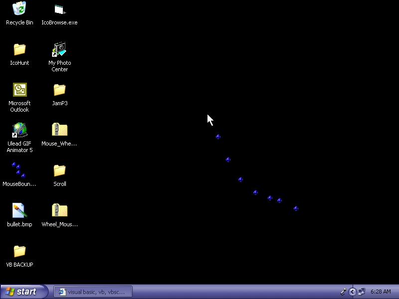



## Elastic String On Desktop\!\!\!\!

### Description

This is a nice "Elastic String" example. it's like the one you see on Web Pages. i got this example on PSC, and remade it. now, the bullets are right on your desktop! You Must See This Thing!   Plese Vote.
 
### More Info
 

             |
---                |---
**Submitted On**   |2002-10-26 06:26:42
**By**             |[Leo Barsukov](https://github.com/Planet-Source-Code/PSCIndex/blob/master/ByAuthor/leo-barsukov.md)
**Level**          |Advanced
**User Rating**    |5.0 (50 globes from 10 users)
**Compatibility**  |VB 6\.0
**Category**       |[Graphics](https://github.com/Planet-Source-Code/PSCIndex/blob/master/ByCategory/graphics__1-46.md)
**World**          |[Visual Basic](https://github.com/Planet-Source-Code/PSCIndex/blob/master/ByWorld/visual-basic.md)
**Archive File**   |[Elastic\_St14894310302002\.zip](https://github.com/Planet-Source-Code/leo-barsukov-elastic-string-on-desktop__1-40167/archive/master.zip)

